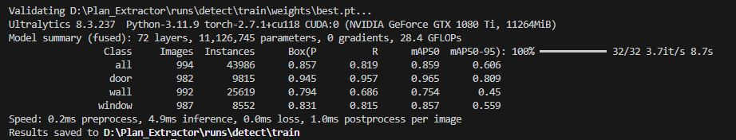

# 🏗️ Система извлечения архитектурной геометрии из планов помещений

[](https://www.python.org/downloads/)
[](https://ultralytics.com/)

## ✨ Возможности

- ✅ Обнаружение и визуализация стен*, дверей и окон с использованием обученной модели YOLO
- ✅ * Визуализация стен — как полилинии (объединённые bounding boxes)
- ✅ Экспорт в JSON — готовый формат для 2D/3D-движков, BIM-систем, веб-приложений

## 📸 Примеры работы

| *Исходное изображение* | *Обработанное изображение* |
|-|-|
|  |  |
|  |  |
|  |  |
|  |  |

## 📁 Структура проекта

      plan_extractor/
      ├── entities/              # DTO: Wall, Door, Window, Plan
      ├── use_cases/             # Подготовка данных
      ├── interfaces/            # Загрузка, вывод данных
      ├── adapters/              # Реализация обработки и визуализации
      ├── runs/                  # Результаты обучения модели YOLO
      │  └── detect/             
      │     └── train/
      │        └── weights/
      │           └── best.pt    # Дообученная модель YOLOv8
      ├── samples/               # Входные изображения для обработки
      ├── output/                # Результаты обработки изображений
      │     └── visualizations/  # Папка с визуализацией обработки
      │     └── *.json           # Результаты обработки в формате JSON
      ├── main.py                # Точка входа
      ├── requirements.txt       # Зависимости проекта
      └── README.md              # Документация

## 📄 Пример файла *.json с результатами обработки

```json
{
  "meta": {
    "source": "samples\\790.jpg"
  },
  "walls": [
    {
      "id": "w0", "points": [[579,50],[586,50],[586,475],[579,475],[579,50]]
    },
    {
      "id": "w1", "points": [[72,354],[271,354],[271,365],[72,365],[72,354]]
    },
   ...
   ],
"doors": [
    {
      "id": "d0", "bbox": [228,223,262,277]
    },
    {
      "id": "d1", "bbox": [227,353,262,412]
    },
   ...
  ],
  "windows": [
    {
      "id": "w0", "bbox": [380,45,426,55]
    },
    {
      "id": "w1", "bbox": [71,171,77,231]
    },
    ...
  ]
}
```

## 🖼️ Визуализированные результаты обучения модели

      plan_extractor/
      └── runs/                  
         └── detect/             
            └── train/

 <p align="left">

</p>           

## 🛠️ Установка

```bash
# Клонирование репозитория
git clone https://github.com/i-koskin/plan_extractor.git
cd plan_extractor
```
```bash
# Создание виртуального окружения
py -m venv venv
```
```bash
source venv/bin/activate  # Linux/MacOS
```
```bash
# или
venv\Scripts\activate  # Windows
```
```bash
# Установка зависимостей
pip install -r requirements.txt
```

## 💻️ Порядок использования

### 1. Загрузите изображения (*.png, *.jpg, *.jpeg) в папку ./samples:

    plan_extractor/
    └── samples/
    
### 2. Запустите модель

```bash
python main.py --visualize
```
⚙️  *При необходимости изменить папки с исходными и обработанными изображениями откорректируйте значения соответствующих аргументов:*

|*Аргумент*|*Описание*|*Значение по умолчанию*|
|-|-|-|
|--input|Папка с исходными изображениями (*.png, *.jpg, *.jpeg)|samples|
|--output|Папка для обработанных изображений|output|

```bash
python main.py --input samples --output output --visualize
```
